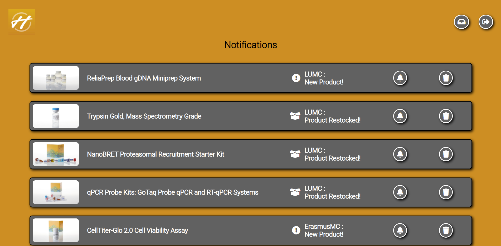

READ-ME
================

Installation Guide
--------------------
### Prerequisites
* Java version 16 or higher
* Apache Tomcat version 9.0.45 or higher
* An IDE or development environment of your choice.

### Step-by-step guide

In this step-by-step guide I will be making use of JetBrains IntelliJ IDE, 
but the steps should be similar for other IDEs.

* Step 1. [Download](https://github.com/DwarfNinja/HelixSystemUpgrade-2021) or clone the project from GitHub.  
  (If you clone the project you can skip to Step 3.)
  
  

* Step 2. Unpack the downloaded zip to your folder of choice.
  
  
  

* Step 3. Open the project with your IDE or code editor of choice.
  
  
  

* Step 4. Let Maven install all needed dependencies and plugins.\
  Install ⟶ Validate
  
  

* Step 5. Setup Tomcat configuration. \
  Create a Local Tomcat configuration
  
  

  Set up the configuration as shown in the example below. Note the underlined elements.
  

* Step 6. Run the application.

How to use the application
---------------------------
### - General
All pages, except the log-in page have two buttons on the header of the page, the left button (inbox icon)
can be clicked to be brought to the notifications page. Next to the notifications button there is a button that 
can be used to log out of the logged-in account (arrow moving away from a door).

### - Log In page
Log in with one of the accounts noted in [all-accounts.json](src/main/resources/json/all-accounts.json) and 
click on the button to log in (arrow moving towards a door). \
For ease of use I have provided some account details below.

**User account:** \
Username: John Doe \
Password: johndoePassword

**Admin account:** \
Username: admin \
Password: admin

### - Account page
On the left side you can view a users profile and account details and on the right-hand side you can 
view a list of all the HelixSystems a user has access to. You can click on one of the HelixSystems to go
to view their inventory.

### - HelixSystem Inventory page
Here you can view the inventory of a HelixSystem with all the products that HelixSystem holds. Clicking on 
one of the products allows you to view more details of that product on the product page.

### - Product page
This is the product page, here you can view more details about the product in question. At the bottom half of the
page you can also view recommendations of other products related to this product.

### - Notifications page
When you press on the "notifications" button you will arrive at the notifications page, 
here you can view the notifications of a user. By pressing on the left button (bel icon) on a 
notification a user can mark that notification as interesting. 
A user can also delete a notification by pressing the right button (trashcan icon).

