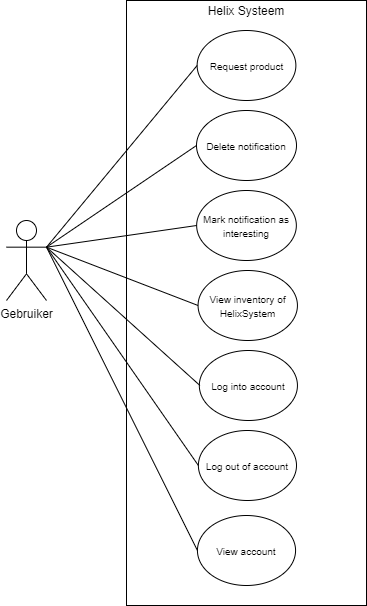
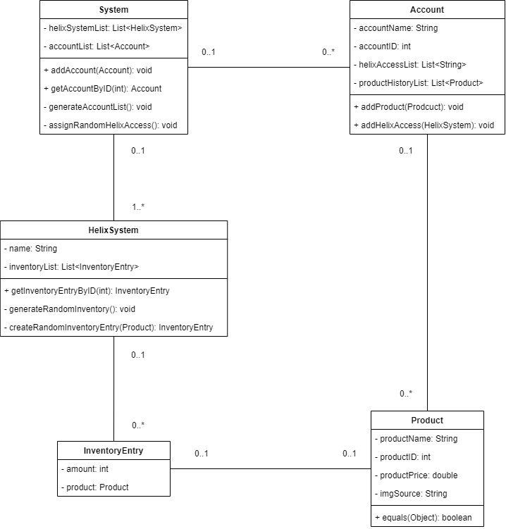

Ontwerp
================
Helix System Upgrade
--------------------

&nbsp;

Datum : 16-05-2021\
Versie : 0.2\
Auteur : CendurOyib

&nbsp;

### Revisiehistorie

| **Datum**  | **Versie** | **Omschrijving** |
|------------|------------|------------------|
| 16-05-2021 |    0.2     |                  |

## Introduction
[ TO BE TRANSLATED TO ENGLISH ]\
Mijn vader is sales manager bij Promega, een laboratorium apparatuur leverancier voor biochemie en
microbiologie. Nu beschikt Promega beschikt over een systeem genaamd Helix, hiermee kunnen
doctoren, laboratorium ingenieurs, laboranten etc. in de life-science online zien wat voor producten op
voorraad zijn en eventueel als een product niet in het systeem zit, kan deze ge-request worden.

Momenteel beschikt het Helix Systeem nog niet over een notificatie systeem die een notificatie stuurt naar de
gebruiker nadat een product dat hij/zij heeft ge-request in het systeem is en zou Promega daarnaast ook
nog een “recommendation systeem” willen, dat op basis van het geselecteerd product andere producten
aanraad die bij dezelfde workflow horen.

Om dit te kunnen maken moet er ook een simpele versie van het huidig Helix systeem worden
nagebouwd, dit houdt in dat de gebruiker kan inloggen op zijn/haar account, kan zien wat hij/zij eerder
uit het Helix Systeem heeft gehaald, producten die niet in het systeem zitten kan requesten en de
huidige voorraad van het Helix systeem zien.
Nu is er al een tijdje gepraat over de implementatie van deze features, maar is Promega er nog niet uit of
ze dit willen implementeren. Het idee is dat na het developen van dit project mijn vader mijn project zal
voorleggen (en eventueel mij het laten presenteren/demonstreren) bij de CEO van de Benelux als
voorbeeld van wat de officiële implementatie zou kunnen zijn.

##  Overview/Rundown/Summary

## Use Cases
Below you can see the Use Cases of this project, with all the actions and events a user has access to.\

## Actors

## Use Case Templates

## Wireframes

## Domain-model

### Entity Description

| **Entity**     | **Discription**                                                     |
|------------------|---------------------------------------------------------------------|
|  System          |  The main system, which has all the HelixSystems and Accounts.      |
|  HelixSystem     |  The HelixSystem class which holds all the data of a HelixSystem.   |
|  Account         |  The Account class which holds all the data of an account.          |
|  Product         |  The Product class, that holds all the data of an certain product.  |
|  InventoryEntry  |  The InventoryItem class, this class represents an InventoryEntry that can be added to a HelixSystem

### Business Rules:
#### System:
- The `helixSystemList` must only contain unique HelixSystems.
- The `accountList` must only contain unique Accounts.
- Generated Accounts by `generateAccountList` can not be duplicates of one another.
- Generated HelixAccessList by `assignRandomHelixAcces` can not contain duplicates of the same HelixSystem.

#### HelixSystem:
- The `name` of the HelixSystem must be unique.
- The `inventoryList` can only contain unique InventoryEntries.
- `getInventoryEntryByID` should return an InventoryEntry or null if it does not exist.
- Each `InventoryEntry` generated by `createRandomInventoryEntry` must contain a Product.

#### Account:
- The `accountID` of an Account must be unique.
- The `helixAccesList` must not contain duplicates.
- `addHelixAcces` can only add to `helixAccesList` if it does not contain the given HelixSystem.

#### Product:
- The `productID` of the Product must be unique.
- The `productPrice` must be a number rounded to two decimal places.

#### InventoryEntry:
- The product must exist and can not be null.
- The amount must exist and must be higher than 0.

## Technologies

## Manual/Handbook/Guide

## References
