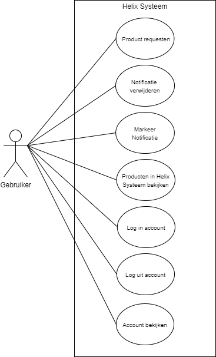
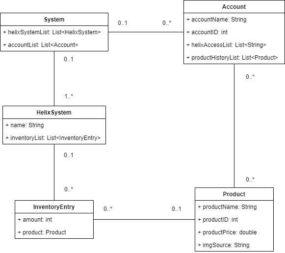

Ontwerp
================
Helix System Upgrade
--------------------

&nbsp;

Datum : 16-05-2021\
Versie : 0.2\
Auteur : CendurOyib

&nbsp;

###Revisiehistorie

| **Datum**  | **Versie** | **Omschrijving** |
|------------|------------|------------------|
| 16-05-2021 |    0.2     |                  |
|            |            |                  |

##Inleiding
Neem hier op hoe het ontwerp tot stand gekomen is alsmede voor wie het bedoeld is 
met eventueel een lezersadvies.

##Overzicht
Korte beschrijving wat het systeem geacht wordt te doen. Eventueel indeling in subsystemen 
met een korte beschrijving van een subsysteem.

##Use cases
\
Use case diagram met een korte toelichting. Zie bij de cursus modelling hoe je dit model maakt.

##Actoren
Bij een actor hoort ook een beschrijving, de actor description. In een actor template wordt 
naast de rolnaam een beschrijving van de rol ingevuld en daarmee een role description geschreven.

##Use Case Templates
Use case templates, per use case een paragraaf met de template beschrijving e.d. zoals geleerd 
bij Modelling.

##Wireframes
De wireframes bij de use cases.

##Domeinmodel
\
De meeste entiteiten uit het conceptueel datamodel hebben een tegenhanger in de vorm van 
een JAVA domeinklasse. Van de student wordt verwacht dat er een UML klassen diagram wordt 
opgeleverd voor de domeinklassen. Zorg dat je UML klassendiagram volledig is.  

Aandachtspunten:
-	Neem alle attributen op met bijbehorende types
-	Neem bij elke associatie de multipliciteiten en de rolnamen op.
-	Maak gebruik van de juiste notatie. Zie de cursus OODC

Neem het diagram op met daarbij een korte beschrijving van alle entiteiten. 
Zie bij de cursus modelling hoe je dit model maakt.

| **Entiteit**  | **Beschrijving** |
|---------------|------------------|
|  Hello World  |    Hello World   |
|  Hello World  |    Hello World   |

Daarnaast kent een domein model eventueel extra regels op het domein (business rules) 
die je niet goed in UML kan vertalen. Deze regels neem je hier puntsgewijs op.

##Technologieën
Voor het realiseren van de applicatie wordt gebruik van de volgende methodieken 
en technieken: UML, Java, SQL, HTML, CSS, J2EE (Servlets), Rest (Jax-RS), Applicatieserver
& HTTP-protocol en een datastore. Beschrijf ook welke frameworks je gebruikt, 
hiervan neem je ook de versie en het licentiemodel op.

##Overdracht
De InstallatieHandleiding is nog niet beschikbaar

##Referenties
Geef hier de bronnenlijst. Gebruik de APA stijl om de bronnen te vermelden.
