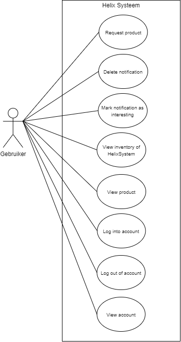
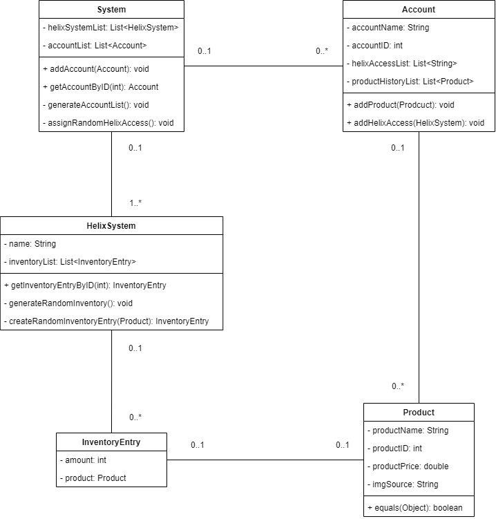

Design Document
================
Helix System Upgrade
--------------------

&nbsp;

Date : 25-06-2021\
Version : 1.0\
Author : CendurOyib

&nbsp;

### Revision history

| **Date**  | **Version** | **Description** |
|------------|------------|------------------|
| 16-05-2021 |    0.1     |                  |
| 03-06-2021 |    0.2     |                  |
| 16-06-2021 |    0.3     |                  |
| 25-06-2021 |    0.4     |                  |

## Introduction
The client (my father) is a sales manager at Promega, a laboratory equipment supplier for biochemistry and
microbiology. Promega has developed a system named Helix, which is a 
specially equipped storage unit (freezer, fridge or cabinet) that can be installed on location. 
The software of a HelixSystem allows doctors, laboratory engineers, laboratory technicians 
and other workers in the life-science industry to be able to view the inventory of a HelixSystem.
A user can also request a product if that is needed.

##Overzicht
Korte beschrijving wat het systeem geacht wordt te doen. Eventueel indeling in subsystemen 
met een korte beschrijving van een subsysteem.

To be able to realise this, a basic/simple version of the current production HelixSystem must be developed. 
This entails that a user must be able to log-in and log-out of their account, must be able to view their account,
see past products they have used, view the current inventory of a HelixSystem and request products for 
that HelixSystem. Promega has already had some discussion in the past around the implementation 
of these features, but have not yet made a decision due to believing this might be too hard to implement. 
The idea of this project is that when development has completed, my client (my father) will present this 
project to the CEO and directors of Promega Benelux als an example of what the official implementation of 
these features could look like.

##  Overview
This system will allow users to access HelixSystems remotely. Basic functionality that the current implementation 
of the HelixSystem has, like viewing a users profile, viewing the inventory of a HelixSystem and requesting new products
will also be integrated into this upgraded version. However, this upgraded HelixSystem will have a few notable
differences that have been requested by the users for a while. The upgrades will include a notification system,
which allows users to receive all sorts of different notifications regarding certain products. Think of subject like: 
a new product, an interesting product, a product that has been restocked etc. . The second feature in this upgraded version
is a recommendation system, this system recommends users other items based on the item they are currently viewing and
items they have used in the past. This allows for better marketability of products to a more specific and better targeted 
audience.

## Use Cases

For the scope of the project only one actor is needed, this actor, when logged in has access to all the 
functionality of the system. In the image below (figure 1) you can see 
the Use Case Diagram associated to this project, with all the actions and functions an actor has access to.
 \
(figure 1)

## Actors

The HelixSystemUpgrade only needs one actor, a user. This actor has access to all the system's functionality when
logged into their account. An administrator or manager is not needed for this project and its use cases. 
This is mainly because this is a demo project showing off the features that can be added to the current HelixSystem 
and therefore other roles apart from those needed for main functionality fall out of the scope of the project.

|  Actor               |  Description                                                                   |  Role            |
|----------------------|--------------------------------------------------------------------------------|------------------|
|  User                |  Has an account on the system and interacts with the system and its functions. Checking their profile and interacting with notifications, viewing HelixSystem inventory and viewing products. | Uses the system and its functionality. |

## Use Case Templates

### - Log into account
|  **ID**              |  0                                                             |
|----------------------|----------------------------------------------------------------|
|  **Name**            |  Log into account                                              |
|  **Actors**          |  Users                                                         |
|  **Description**     |  Logging into the account tied to the user.                    |
|  **Pre-condition**   |  The actor has an account registered to their name.            |
|  **Scenario**        |  1. The actor navigates to the log in page.   2. The actor enters their user name and password in the specified fields.   3.The system validates and authenticates the actor.   4.The system brings the actor to their account page.  |
|  **Post-condition**  |  The actor has logged into their account.                      |

### - Log out of account
|  **ID**              |  1                                                                    |
|----------------------|-----------------------------------------------------------------------|
|  **Name**            |  Log out of account                                                   |
|  **Actors**          |  Users                                                                |
|  **Description**     |  Logging out of the account tied to the user.                         |
|  **Pre-condition**   |  The actor has an account registered to their name and is logged in.  |
|  **Scenario**        |  1. The actor clicks on the button to log out.   2. The system processes the request and logs the user out.   3.The system brings the actor back to the log-in page.  |
|  **Post-condition**  |  The actor has logged out of their account.                           |

### - View account
|  **ID**              |  2                                                                    |
|----------------------|-----------------------------------------------------------------------|
|  **Name**            |  View Account                                                         |
|  **Actors**          |  Users                                                                |
|  **Description**     |  Viewing the account tied to the user.                                |
|  **Pre-condition**   |  The actor is logged in.                                              |
|  **Scenario**        |  1. The actor navigates to the account page.   2. The actor can view their account.  |
|  **Post-condition**  |  The actor has viewed their account.                                  |

### - View inventory of HelixSystem
|  **ID**              |  3                                                             |
|----------------------|----------------------------------------------------------------|
|  **Name**            |  View inventory of HelixSystem                                 |
|  **Actors**          |  Users                                                         |
|  **Description**     |  Viewing the products and contents of a  HelixSystem.          |
|  **Pre-condition**   |  The actor has logged in, and has the rights to view the inventory of the chosen HelixSystem.
|  **Scenario**        |  1.The actor clicks on the HelixSystem inventory they want to view.   2. The system brings the actor to the chosen inventory page.   2. The actor can view the products in the chosen HelixSystem. |
|  **Post-condition**  |  The actor has viewed the products in the chosen HelixSystem.  |

### - View product
|  **ID**              |  4                                                                    |
|----------------------|-----------------------------------------------------------------------|
|  **Name**            |  View product page                                                    |
|  **Actors**          |  Users                                                                |
|  **Description**     |  Viewing a specific product page in the inventory of the HelixSystem. |
|  **Pre-condition**   |  The actor is on the chosen HelixSystem inventory page.               |
|  **Scenario**        |  1. The actor clicks on the specific product they want to view.   2. The system brings the actor to the chosen product page   3. The actor can view the chosen product.
|  **Post-condition**  |  The actor has viewed the product page the want to view.              |

### - View notifications
|  **ID**              |  5                                                                    |
|----------------------|-----------------------------------------------------------------------|
|  **Name**            |  View notifications page                                              |
|  **Actors**          |  Users                                                                |
|  **Description**     |  Viewing the notifications page.                                      |
|  **Pre-condition**   |  The actor is logged in.                                              |
|  **Scenario**        |  1. The actor navigates to the notification page.   2. The system brings the actor to their notification page.   3. The actor can view their notifications.
|  **Post-condition**  |  The actor has viewed their notifications.                            |

### - Delete notifications
|  **ID**              |  6                                                                    |
|----------------------|-----------------------------------------------------------------------|
|  **Name**            |  Delete notification                                                  |
|  **Actors**          |  Users                                                                |
|  **Description**     |  Deleting a certain notification.                                     |
|  **Pre-condition**   |  The actor is logged in and has navigated to the notifications page.  |
|  **Scenario**        |  1. The clicks on the delete button on the notification they want to delete.   2. The system deletes the notification from their account.   3. The actor sees the notification has deleted.
|  **Post-condition**  |  The actor has deleted a notification.                                |

## Wireframes
### - Log-in Page

(figure 2)
### - Account Page

(figure 3)
### - Inventory Page

(figure 4)
### - Product Page

(figure 5)
### - Notifications Page

(figure 6)

## Domain-model
Below (figure 7) you can see the Domain-model that belongs to this project. I have chosen for these classes as these are the classes
needed to allow for the implementation of the use cases. Next to this, I wanted to have a clean codebase and structure,
and having certain classes split up, allows for more dynamic adaptability and manipulation of the code when needed,
if everything is intertwined it is difficult to make changes to the code along the way and also creates a messy structure.
With this approach, also known as decoupling, each object/class is as independent as possible frome each other and 
handles its own functionality without relying on other objects/classes.

(figure 7)

|  **Entity**     |  **Description**                                                     |
|------------------|---------------------------------------------------------------------|
|  System          |  The main system, which has all the HelixSystems and Accounts.      |
|  HelixSystem     |  The HelixSystem class which holds all the data of a HelixSystem.   |
|  Account         |  The Account class which holds all the data of an account.          |
|  Product         |  The Product class, that holds all the data of an certain product.  |
|  InventoryEntry  |  The InventoryItem class, this class represents an InventoryEntry that can be added to a HelixSystem |

##Technologieën
Voor het realiseren van de applicatie wordt gebruik van de volgende methodieken 
en technieken: UML, Java, SQL, HTML, CSS, J2EE (Servlets), Rest (Jax-RS), Applicatieserver
& HTTP-protocol en een datastore. Beschrijf ook welke frameworks je gebruikt, 
hiervan neem je ook de versie en het licentiemodel op.

##Overdracht
De InstallatieHandleiding is nog niet beschikbaar

##Referenties
Geef hier de bronnenlijst. Gebruik de APA stijl om de bronnen te vermelden.

#### Product:
- The `productID` of the Product must be unique.
- The `productPrice` must be a number rounded to two decimal places.

#### InventoryEntry:
- The product must exist and can not be null.
- The amount must exist and must be higher than 0.

## Technologies

In the tables below I have described all the technologies I have made use of during this project, with a short
explanation and some details of their use, the versioning used for development, and the license attached to that technology.

|  Back-end Technologies  |  Details                                                     |  Version              | License                                                     |
|-------------------------|--------------------------------------------------------------|-----------------------|-------------------------------------------------------------|
|  Java                   |  Language used for the backend                               |  Open JDK 16          | GNU General Public License v2                               |
|  JSON                   |  File format standard use for storing and transferring data  |  Json 20180130        | The JSON License                                            |
|  Jackson                |  Module that serialize and deserialize data                  |  Jackson 2.12.3       | Apache License 2.0                                          |
|  Jersey                 |  Framework API that helps handle REST web services creation  |  Jersey 2.34          | Eclipse Public License v2.0 & GNU General Public License v2 |
|  JUnit                  |  Framework for creating unit tests for Java applications     |  JUnit 5 5.6.3        | IBM's Common Public License Version 0.5                     |
|  JJWT                   |  Java implemented library for encrypting data                |  JSON Web Token 0.9.1 | Apache License 2.0                                          |

|  Front-end Technologies   | Details                                                 |  Version        |  License                       |
|---------------------------|---------------------------------------------------------|-----------------|--------------------------------|
|  HTML                     | Language used for creating webpages                     |  HTML 5         |  N/A                           |
|  CSS                      | Language used for styling and presentation of a webpage |  CSS 2.1        |  N/A                           |
|  JavaScript               | Language used for scripting of a webpage                |  ECMAScript 6+  |  GNU General Public License v2 |

|  Deployment Technologies  |  Details                                                                   |  Version                   | License            |
|---------------------------|----------------------------------------------------------------------------|----------------------------|--------------------|
|  Maven                    |  Tool used that helps automates building and managing Java projects        |  Maven 3.6.3               | Apache License 2.0 |
|  Tomcat                   |  Software used to create a Java HTTP web server                            |  Tomcat 9.0.45             | Apache License 2.0 |
|  Heroku                   |  A cloud platform service which allows deploying the project on the cloud  |  Heroku 20 & Tomcat 9.0.41 | ISC license        |

## Manual
Check the [README.MD](/README.MD) for a guide on how to  install and use the application.

## References
Below you can view the sources used when developing this project. Excluded from this list, 
are social media platforms like Youtube, StackOverflow, Reddit and GitHub.

|  Author                                   |  Published     | Title                                  | Publisher                | URL                                           |
|-------------------------------------------|----------------|----------------------------------------|--------------------------|-----------------------------------------------|
|  Mozilla                                  |  2005-Present  | MDN Web Docs                           | Mozilla                  | https://developer.mozilla.org/en-US/          |
|  Oracle                                   |  2002-Present  | Java Platform Docs                     | Oracle                   | https://docs.oracle.com/en/java/index.html    |
|  Baeldung                                 |  2012-Present  | Spring Web Docs                        | Baeldung                 | https://www.baeldung.com/javadoc              |
|  Ronald G. Ross                           |  2006          | The RuleSpeak® Business Rule Notation  | Business Rules Community | http://www.brcommunity.com/a2006/b282.html    |
|  Chris Coyier & CSS-Tricks guest authors  |  2007-Present  | CSS-Tricks                             | CSS-Tricks               | https://css-tricks.com/c                      |
|  Pete LePage & Rachel Andrew              |  2019-2020     | Responsive web design basics           | Web.dev                  | https://web.dev/responsive-web-design-basics/ |
