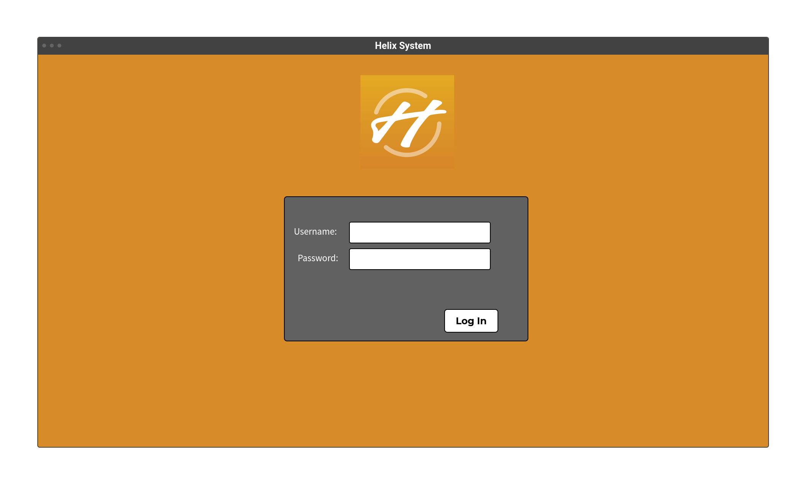
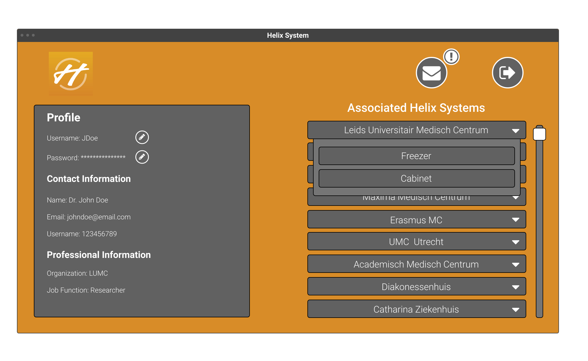
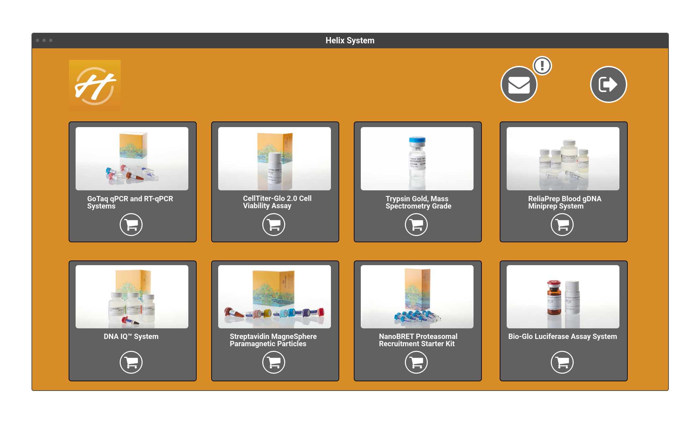
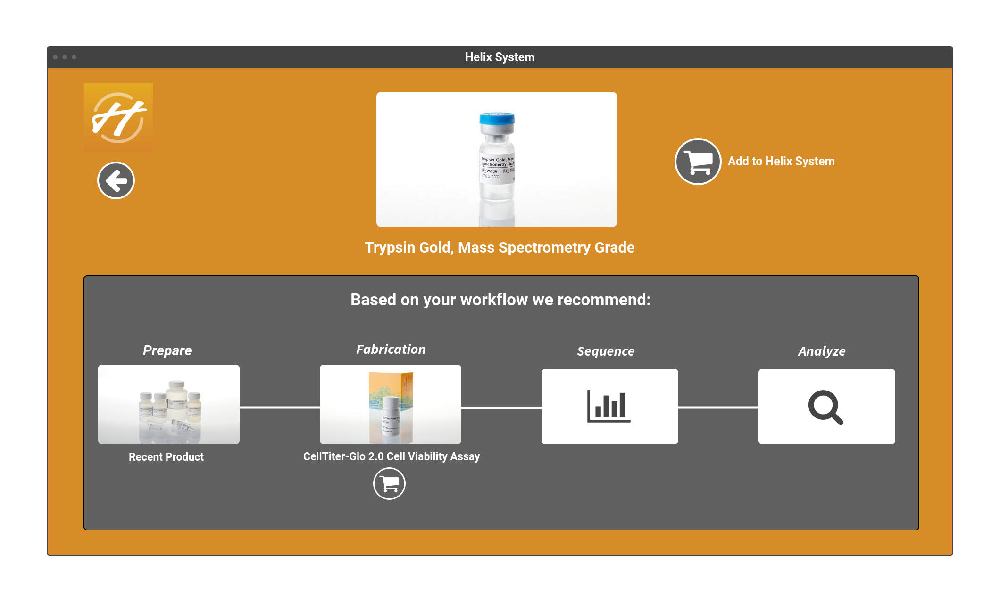
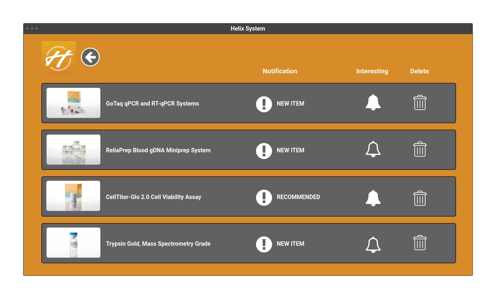

Ontwerp
================
Helix System Upgrade
--------------------

&nbsp;

Datum : 16-05-2021\
Versie : 0.2\
Auteur : CendurOyib

&nbsp;

### Revisiehistorie

| **Datum**  | **Versie** | **Omschrijving** |
|------------|------------|------------------|
| 16-05-2021 |    0.1     |                  |
| 03-06-2021 |    0.2     |                  |
| 16-06-2021 |    0.3     |                  |

## Introduction
[ TO BE TRANSLATED TO ENGLISH ]\
The client (my father) is a sales manager at Promega, a laboratory equipment supplier for biochemistry and
microbiology. Promega has developed a system named Helix, which is a 
specially equipped storage unit (freezer, fridge or cabinet) that can be installed on location. 
The software of a HelixSystem allows doctors, laboratory engineers, laboratory technicians 
and other workers in the life-science industry to be able to view the inventory of a HelixSystem.
A user can also request a product if that is needed.

However currently the HelixSystem does not possess over any kind of notification system. 
This is part of my assignment, a notification system which will notify a user if a product they 
have requested is back in stock or notify them over other products they might be interested in.
The second part of my assignment is a recommendation system. Promega wants a system which recommends
products to a user that are related to the same workflow to the product they are currently viewing.

To be able to realise this, a basic/simple version of the current production HelixSystem must be developed. 
This entails that a user must be able to log-in and log-out of their account, must be able to view their account,
see past products they have used, view the the current inventory of a HelixSystem and request products for 
that HelixSystem. Promega has already had some discussion in the past around the implementation 
of these features, but have not yet made a decision due to believing this might be too hard to implement. 
The idea of this project is that when development has completed, my client (my father) will present this 
project to the CEO and directors of Promega Benelux als an example of what the official implementation of 
these features could look like.

##  Overview/Rundown/Summary

## Use Cases
Below you can see the Use Cases of this project, with all the actions and events a user has access to.\

## Actors

## Use Case Templates

### - Log into account
|  **ID**              |  0                                                             |
|----------------------|----------------------------------------------------------------|
|  **Name**            |  Log into account                                              |
|  **Actors**          |  Users                                                         |
|  **Description**     |  Logging into the account tied to the user.                    |
|  **Pre-condition**   |  The actor has an account registered to their name.            |
|  **Scenario**        |  1. The actor navigates to the log in page.   2. The actor enters their user name and password in the specified fields.   3.The system validates and authenticates the actor.   4.The system brings the actor to their account page.  |
|  **Post-condition**  |  The actor has logged into their account.                      |

### - View account
|  **ID**              |  1                                                                    |
|----------------------|-----------------------------------------------------------------------|
|  **Name**            |  View Account                                                         |
|  **Actors**          |  Users                                                                |
|  **Description**     |  Viewing the account tied to the user .                               |
|  **Pre-condition**   |  The actor is logged in.                                              |
|  **Scenario**        |  1. The actor navigates to the account page.   2. The actor can view their account.  |
|  **Post-condition**  |  The actor has viewed their account.                                  |

### - View inventory of HelixSystem
|  **ID**              |  2                                                             |
|----------------------|----------------------------------------------------------------|
|  **Name**            |  View inventory of HelixSystem                                 |
|  **Actors**          |  Users                                                         |
|  **Description**     |  Viewing the products and contents of a  HelixSystem.          |
|  **Pre-condition**   |  The actor has logged in, and has the rights to view the inventory of the chosen HelixSystem.
|  **Scenario**        |  1.The actor clicks on the HelixSystem inventory they want to view.   2. The system brings the actor to the chosen inventory page.   2. The actor can view the products in the chosen HelixSystem. |
|  **Post-condition**  |  The actor has viewed the products in the chosen HelixSystem.  |

### - View product
|  **ID**              |  3                                                                    |
|----------------------|-----------------------------------------------------------------------|
|  **Name**            |  View product page                                                    |
|  **Actors**          |  Users                                                                |
|  **Description**     |  Viewing a specific product page in the inventory of the HelixSystem. |
|  **Pre-condition**   |  The actor is on the chosen HelixSystem inventory page.               |
|  **Scenario**        |  1. The actor clicks on the specific product they want to view.   2. The system brings the actor to the chosen product page   3. The actor can view the chosen product.
|  **Post-condition**  |  The actor has viewed the product page the want to view.              |

### - View notifications
|  **ID**              |  4                                                                    |
|----------------------|-----------------------------------------------------------------------|
|  **Name**            |  View notifications page                                              |
|  **Actors**          |  Users                                                                |
|  **Description**     |  Viewing the notifications page.                                      |
|  **Pre-condition**   |  The actor is logged in.                                              |
|  **Scenario**        |  1. The actor navigates to the notification page.   2. The system brings the actor to their notification page.   3. The actor can view their notifications.
|  **Post-condition**  |  The actor has viewed their notifications.                            |

### - Delete notifications
|  **ID**              |  5                                                                    |
|----------------------|-----------------------------------------------------------------------|
|  **Name**            |  Delete notification                                                  |
|  **Actors**          |  Users                                                                |
|  **Description**     |  Deleting a certain notification.                                     |
|  **Pre-condition**   |  The actor is logged in and has navigated to the notifications page.  |
|  **Scenario**        |  1. The clicks on the delete button on the notification they want to delete.   2. The system deletes the notification from their account.   3. The actor sees the notification has deleted.
|  **Post-condition**  |  The actor has deleted a notification.                                |

## Wireframes
### - Log-in Page

### - Account Page

### - Inventory Page

### - Product Page

### - Notifications Page

## Domain-model

| **Entiteit**  | **Beschrijving** |
|---------------|------------------|
|  Hello World  |    Hello World   |
|  Hello World  |    Hello World   |

|  **Entity**     |  **Discription**                                                     |
|------------------|---------------------------------------------------------------------|
|  System          |  The main system, which has all the HelixSystems and Accounts.      |
|  HelixSystem     |  The HelixSystem class which holds all the data of a HelixSystem.   |
|  Account         |  The Account class which holds all the data of an account.          |
|  Product         |  The Product class, that holds all the data of an certain product.  |
|  InventoryEntry  |  The InventoryItem class, this class represents an InventoryEntry that can be added to a HelixSystem |

### Business Rules:
#### System:
- The `helixSystemList` must only contain unique HelixSystems.
- The `accountList` must only contain unique Accounts.
- Generated Accounts by `generateAccountList` can not be duplicates of one another.
- Generated HelixAccessList by `assignRandomHelixAcces` can not contain duplicates of the same HelixSystem.

#### HelixSystem:
- The `name` of the HelixSystem must be unique.
- The `inventoryList` can only contain unique InventoryEntries.
- `getInventoryEntryByID` should return an InventoryEntry or null if it does not exist.
- Each `InventoryEntry` generated by `createRandomInventoryEntry` must contain a Product.

#### Account:
- The `accountID` of an Account must be unique.
- The `helixAccesList` must not contain duplicates.
- `addHelixAcces` can only add to `helixAccesList` if it does not contain the given HelixSystem.

#### Product:
- The `productID` of the Product must be unique.
- The `productPrice` must be a number rounded to two decimal places.

#### InventoryEntry:
- The product must exist and can not be null.
- The amount must exist and must be higher than 0.

## Technologies

## Manual/Handbook/Guide

## References
